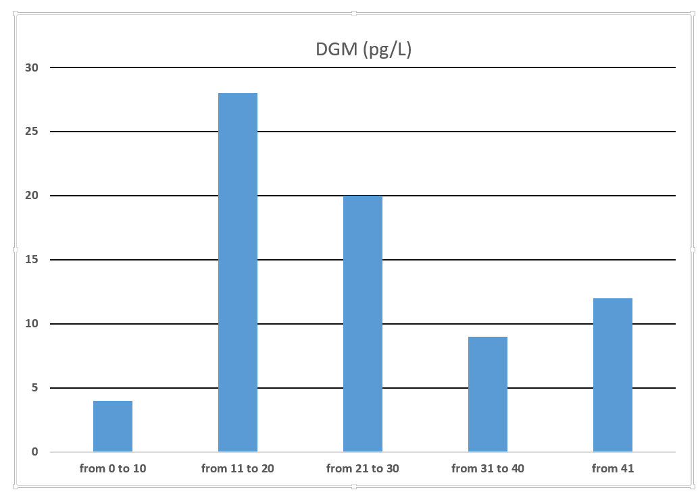
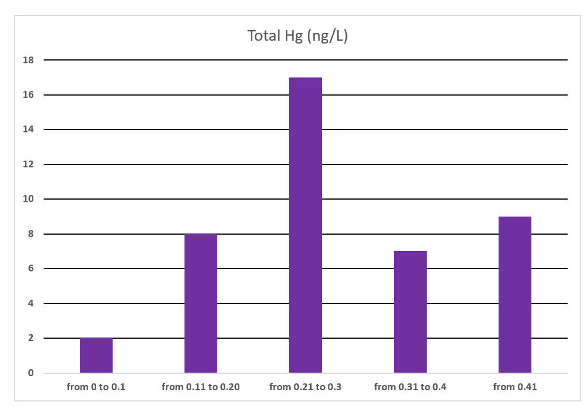
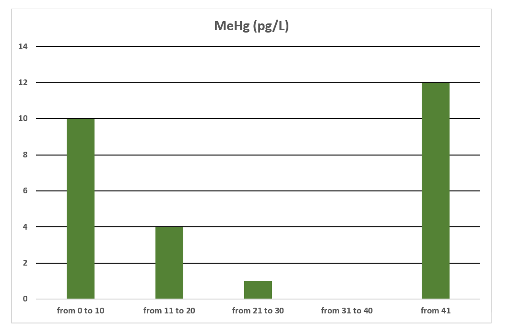
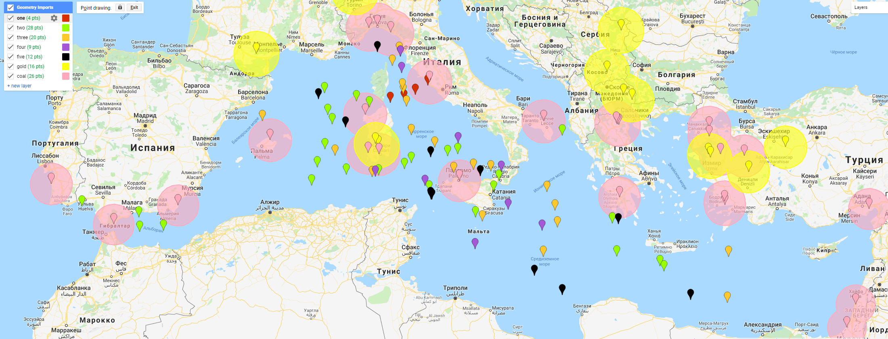
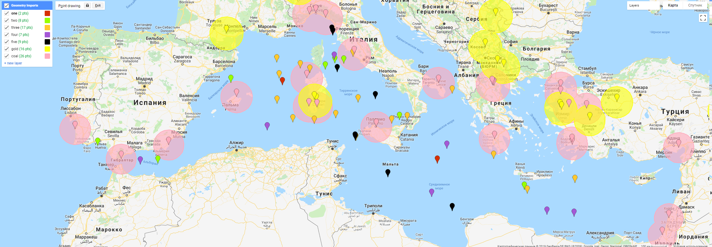
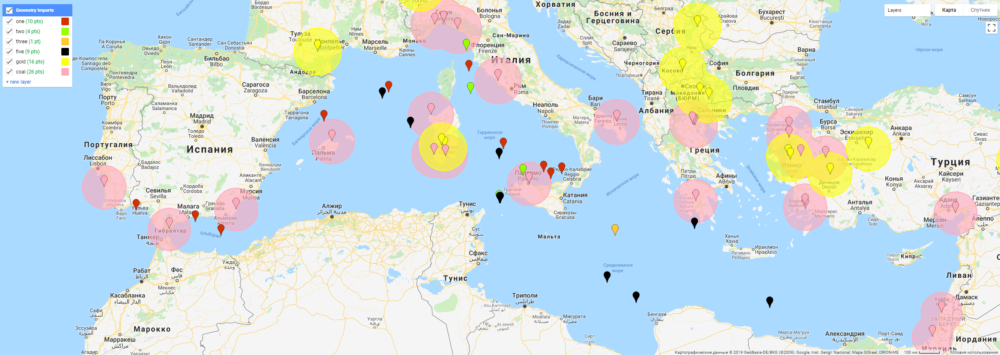

# geospatial-analysis
Mercury in the Mediterranean Sea
There are measurements of ships for different years: Hg 2000 - 2015
Main sources of mercury are gold production and coal combustion:

The coordinates of the main gold production and coal combustion in Europe were found.
We divide the data into 5 classes of pollution:

The data of the following satellites were uploaded:
 - Modis Aqua (https://developers.google.com/earth-engine/datasets/catalog/NASA_OCEANDATA_MODIS-Aqua_L3SMI)
 - NOAA CDR AVHRR AOT (https://developers.google.com/earth-engine/datasets/catalog/NOAA_CDR_AVHRR_AOT_V3)
 - Sentinel-3 (https://developers.google.com/earth-engine/datasets/catalog/COPERNICUS_S3_OLCI)
 Then it was checked how the measurements of the ships and satellite images correlated between themselves in the given coordinates.
